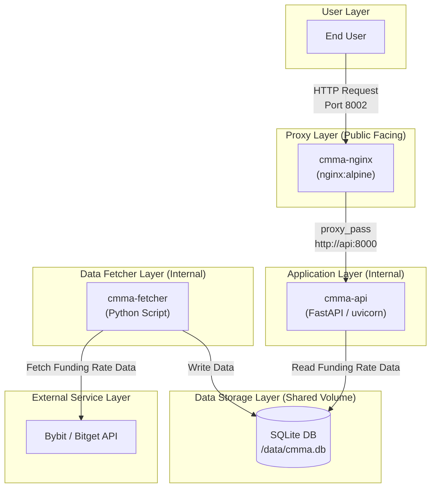

<!-- START doctoc generated TOC please keep comment here to allow auto update -->
<!-- DON'T EDIT THIS SECTION, INSTEAD RE-RUN doctoc TO UPDATE -->
**Table of Contents**  *generated with [DocToc](https://github.com/thlorenz/doctoc)*

- [cmma (Crypto Market Abnormal-funding-rate API)](#cmma-crypto-market-abnormal-funding-rate-api)
  - [機能](#%E6%A9%9F%E8%83%BD)
  - [必要要件](#%E5%BF%85%E8%A6%81%E8%A6%81%E4%BB%B6)
  - [実行方法](#%E5%AE%9F%E8%A1%8C%E6%96%B9%E6%B3%95)
  - [API利用方法](#api%E5%88%A9%E7%94%A8%E6%96%B9%E6%B3%95)
    - [APIドキュメント (Swagger UI)](#api%E3%83%89%E3%82%AD%E3%83%A5%E3%83%A1%E3%83%B3%E3%83%88-swagger-ui)
    - [エンドポイント: `GET /funding-rates`](#%E3%82%A8%E3%83%B3%E3%83%89%E3%83%9D%E3%82%A4%E3%83%B3%E3%83%88-get-funding-rates)
      - [クエリパラメータ](#%E3%82%AF%E3%82%A8%E3%83%AA%E3%83%91%E3%83%A9%E3%83%A1%E3%83%BC%E3%82%BF)
      - [使用例 (curl)](#%E4%BD%BF%E7%94%A8%E4%BE%8B-curl)
      - [成功レスポンスの例](#%E6%88%90%E5%8A%9F%E3%83%AC%E3%82%B9%E3%83%9D%E3%83%B3%E3%82%B9%E3%81%AE%E4%BE%8B)
    - [エンドポイント: `GET /funding-rates/extreme-continuity`](#%E3%82%A8%E3%83%B3%E3%83%89%E3%83%9D%E3%82%A4%E3%83%B3%E3%83%88-get-funding-ratesextreme-continuity)
      - [クエリパラメータ](#%E3%82%AF%E3%82%A8%E3%83%AA%E3%83%91%E3%83%A9%E3%83%A1%E3%83%BC%E3%82%BF-1)
      - [統計指標について](#%E7%B5%B1%E8%A8%88%E6%8C%87%E6%A8%99%E3%81%AB%E3%81%A4%E3%81%84%E3%81%A6)
      - [使用例 (curl)](#%E4%BD%BF%E7%94%A8%E4%BE%8B-curl-1)
      - [成功レスポンスの例](#%E6%88%90%E5%8A%9F%E3%83%AC%E3%82%B9%E3%83%9D%E3%83%B3%E3%82%B9%E3%81%AE%E4%BE%8B-1)
    - [エラーレスポンス](#%E3%82%A8%E3%83%A9%E3%83%BC%E3%83%AC%E3%82%B9%E3%83%9D%E3%83%B3%E3%82%B9)
    - [エラーレスポンス](#%E3%82%A8%E3%83%A9%E3%83%BC%E3%83%AC%E3%82%B9%E3%83%9D%E3%83%B3%E3%82%B9-1)
  - [アプリケーションの停止](#%E3%82%A2%E3%83%97%E3%83%AA%E3%82%B1%E3%83%BC%E3%82%B7%E3%83%A7%E3%83%B3%E3%81%AE%E5%81%9C%E6%AD%A2)
  - [システム構成](#%E3%82%B7%E3%82%B9%E3%83%86%E3%83%A0%E6%A7%8B%E6%88%90)
    - [データフロー](#%E3%83%87%E3%83%BC%E3%82%BF%E3%83%95%E3%83%AD%E3%83%BC)
    - [Mermaid ダイアグラム](#mermaid-%E3%83%80%E3%82%A4%E3%82%A2%E3%82%B0%E3%83%A9%E3%83%A0)

<!-- END doctoc generated TOC please keep comment here to allow auto update -->

# cmma (Crypto Market Abnormal-funding-rate API)

BybitまたはBitgetの全USDT無期限契約ペアの資金調達率（Funding Rate）を定期的に収集し、指定した閾値に基づいて異常な金利を持つ銘柄を問い合わせできるAPIサーバーです。

## 機能

- **データ収集 (Fetcher)**:
  - `.env`の`EXCHANGE`で選択した取引所（`bybit`または`bitget`）から全銘柄のFunding Rateを非同期で取得します。
  - 取得したデータは、`./data`ディレクトリ内のSQLiteデータベース (`cmma.db`) に保存されます。
  - デフォルトでは5分ごとにデータを更新します。
  - **注意事項**: Bybit APIのレートリミットは、IPアドレスごとに5秒間に600件のリクエストです。BitgetのFunding Rate系APIは、IPアドレスごとに1秒間20件のリクエストです。(`CONCURRENCY_LIMIT` 設定の参考にしてください)
    - [Rate Limit Rules | Bybit API Documentation](https://bybit-exchange.github.io/docs/v5/rate-limit)
    - [Get Current Funding Rate | Bitget API Documentation](https://www.bitget.com/api-doc/contract/market/Get-Current-Funding-Rate)
    - [Get Historical Funding Rates | Bitget API Documentation](https://www.bitget.com/api-doc/contract/market/Get-History-Funding-Rate)
    - デフォルトの`.env.example`設定では、`CONCURRENCY_LIMIT=10`に設定されています。

- **APIサーバー (API)**:
  - `fetcher`が保存したデータベースを読み取ります。
  - 指定された閾値（絶対値）を超えるFunding Rateを持つ銘柄を、金利が高い順に返却します。
  - APIドキュメント（Swagger UI）を自動生成し、統一されたエラーレスポンスを返します。

## 必要要件

- Docker
- Docker Compose

## 実行方法

1. **環境変数の設定**

   `.env.example`ファイルをコピーして`.env`ファイルを作成し、必要に応じて設定を編集します。

   ```shell
   cp .env.example .env
   ```

   `.env`ファイルで以下の変数を設定できます。

   - `EXCHANGE`: 利用する取引所。`bybit`または`bitget`（デフォルト: `bybit`）
   - `BITGET_PRODUCT_TYPE`: Bitget利用時の商品タイプ。USDT無期限は`usdt-futures`（デフォルト: `usdt-futures`）
   - `FETCH_INTERVAL_SECONDS`: データ取得サイクルの間隔（秒）
   - `CONCURRENCY_LIMIT`: 取引所APIへの同時リクエスト数。Bitget利用時は`20`以下を推奨
   - `FUNDING_RATE_THRESHOLD`: `fetcher`サービスがログに「異常金利候補」として記録するための閾値（APIのレスポンスには影響しません）。

   Bitgetへ切り替える例:

   ```dotenv
   EXCHANGE=bitget
   BITGET_PRODUCT_TYPE=usdt-futures
   CONCURRENCY_LIMIT=10
   ```

2. **アプリケーションの起動**

   以下のコマンドで、Dockerコンテナのビルドと起動が行われます。

   初回起動時はフォアグラウンドで実行してログを確認することをお勧めします。
   ```shell
    docker-compose up --build
   ```

    問題がなければ、`-d`オプションを付けてバックグラウンドで実行します。
   ```shell
   docker-compose up --build -d
   ```

3. **動作確認**

   - **Fetcherのログ確認**: データ取得の進捗と所要時間を確認できます。
     ```shell
     docker-compose logs -f cmma-fetcher
     ```
   - **APIのログ確認**:
     ```shell
     docker-compose logs -f cmma-api
     ```
   - **Nginxのログ確認**:
     ```shell
     docker-compose logs -f cmma-nginx
     ```

## API利用方法

APIサーバーはNginxリバースプロキシ経由で `http://localhost:8002` で公開されます。

### APIドキュメント (Swagger UI)

Webブラウザで `http://localhost:8002/docs` にアクセスすると、Swagger UIが表示されます。
各エンドポイントの詳細な説明と、ブラウザ上でのAPIテストが可能です。

### エンドポイント: `GET /funding-rates`

**大きさ(`threshold`)と方向(`direction`)** でFunding Rateをフィルタリングし、条件に一致する銘柄を返します。

#### クエリパラメータ

- `threshold` (必須, float, > 0):
  - Funding Rateの「大きさ」を指定する閾値（常に正の値）。
  - この値の絶対値以上のFunding Rateを持つ銘柄が対象となります (`|rate| >= threshold`)。
  - 例: `0.002` (0.2%)
- `direction` (任意, string, デフォルト: `both`):
  - Funding Rateの「方向」でフィルタします。
  - `positive`: Rate > 0 の銘柄（ロングが過熱）
  - `negative`: Rate < 0 の銘柄（ショートが過熱）
  - `both`: 方向でフィルタしない
- `sort` (任意, string, デフォルト: `funding_abs_desc`):
  - 結果のソート順を指定します。
  - `funding_abs_desc`: Funding Rateの絶対値の降順（需給の偏りが強い順）
  - `funding_rate_desc`: Funding Rateの降順（正のFRが強い順）
  - `funding_rate_asc`: Funding Rateの昇順（負のFRが強い順）
  - `utilization_desc`: Funding Rate利用率の降順
  - `symbol_asc`: シンボル名の昇順
- `limit` (任意, integer, デフォルト: `100`):
  - 取得する最大件数（`1`～`500`）。
- `utilization_gte` (任意, float):
  - Funding Rateの利用率（`funding.utilization`）の最小値でフィルタします。
  - 値は `0.0`～`1.0` の範囲です。（例: `0.5` は利用率50%以上）

#### 使用例 (curl)

**1. FRが `0.2%` 以上で、かつマイナスの銘柄（ショート過熱）を、FRが小さい順（マイナス度合いが強い順）に取得**
```shell
curl -s "http://localhost:8002/funding-rates?threshold=0.002&direction=negative&sort=funding_rate_asc&limit=5" | jq
```

**2. FRの絶対値が `0.1%` 以上の銘柄を、絶対値が大きい順に取得（方向は問わない）**
```shell
curl -s "http://localhost:8002/funding-rates?threshold=0.001&sort=funding_abs_desc&limit=10" | jq
```

**3. FRがプラスの銘柄を、レートが高い順に取得 (閾値は最小限に設定)**
```shell
curl -s "http://localhost:8002/funding-rates?threshold=0.000001&direction=positive&sort=funding_rate_desc&limit=10" | jq
```

#### 成功レスポンスの例

```json
{
  "count": 1,
  "data": [
    {
      "symbol": "BTCUSDT",
      "funding_ts": 1765584000000,
      "next_funding_ts": 1765612800000,
      "funding": {
        "rate": -0.0025,
        "utilization": 0.125
      },
      "constraints": {
        "interval_hours": 8,
        "cap": 0.02,
        "floor": -0.02
      }
    }
  ]
}
```

---

### エンドポイント: `GET /funding-rates/extreme-continuity`

指定した銘柄のFunding Rate履歴を分析し、**極端な状態の継続性**に関する指標を返します。

#### クエリパラメータ

- `symbol` (必須, string):
  - 分析対象の銘柄シンボル (例: `BTCUSDT`)。
- `threshold` (必須, float, > 0):
  - 「極端」と判断するためのFunding Rateの閾値 (絶対値)。
  - `direction` が `positive` の場合 `rate >= threshold`、`negative` の場合 `rate <= -threshold` で評価されます。
  - 例: `0.0002`
- `lookback` (必須, integer):
  - 分析対象とする最新の履歴件数 (`2`～`200`)。
- `direction` (任意, string, デフォルト: `both`):
  - 分析対象とするFunding Rateの方向を指定します。
  - `positive`: 正のFRのみを分析
  - `negative`: 負のFRのみを分析
  - `both`: 方向を問わず `|rate| >= threshold` で分析

#### 統計指標について

- **`consecutive_hit_rate` (連続ヒット継続率)**:
  - 最新のデータから遡って、「極端な状態」が連続している回数の割合。市場の短期的な過熱感を示します。
- **`total_hit_rate` (有効区間内継続率)**:
  - `lookback`期間全体で、「極端な状態」が発生した総回数の割合。市場の支配的なバイアスを示します。
- **`average_run_length` (平均ラン長)**:
  - 「極端な状態」が連続した期間（ラン）の平均的な長さ。状態の持続性を示します。

#### 使用例 (curl)

**1. BTCUSDTの直近48件の履歴で、FRが `-0.01%` 以下 (ショート過熱) の状態の継続性を分析**
```shell
curl -s "http://localhost:8002/funding-rates/extreme-continuity?symbol=BTCUSDT&threshold=0.0001&lookback=5&direction=negative" | jq
```

**2. 1000PEPEUSDTの直近24件の履歴で、FRの絶対値が `0.1%` 以上の状態の継続性を分析 (方向は問わない)**
```shell
curl -s "http://localhost:8002/funding-rates/extreme-continuity?symbol=1000PEPEUSDT&threshold=0.001&lookback=5" | jq
```

#### 成功レスポンスの例

```json
{
  "symbol": "BTCUSDT",
  "threshold": 0.0001,
  "lookback": 5,
  "stats": {
    "consecutive_hit_rate": 0.0625,
    "total_hit_rate": 0.3541666666666667,
    "average_run_length": 4.25
  },
  "history": [
    {
      "symbol": "BTCUSDT",
      "funding_ts": 1765612800000,
      "next_funding_ts": 1765641600000,
      "funding": {
        "rate": -0.00015,
        "utilization": null
      },
      "constraints": {
        "interval_hours": 8,
        "cap": 0.02,
        "floor": -0.02
      }
    }
    // ... history data ...
  ]
}
```

### エラーレスポンス

### エラーレスポンス

APIは標準化されたエラー形式を返します。

```json
{
  "error": {
    "code": "INVALID_INPUT",
    "message": "[query->funding_rate_threshold]: Field required"
  }
}
```

## アプリケーションの停止

```shell
docker-compose down
```
ボリューム（`./data`ディレクトリ内のDBファイル）は削除されません。DBをリセットしたい場合は、手動で`./data/`cmma.db``ファイルを削除してください。

## システム構成

このシステムは、`docker-compose`によって管理される3つの主要なサービス（`fetcher`, `api`, `nginx`）で構成されています。

1.  **fetcher (データ取得レイヤー)**
    *   定期的に`.env`で選択した取引所APIにアクセスし、仮想通貨の資金調達率（Funding Rate）データを取得します。
    *   取得したデータは、共有ボリューム内のSQLiteデータベース（`cmma.db`）に保存します。
    *   このサービスはバックグラウンドで動作するバッチプロセスです。

2.  **api (アプリケーションレイヤー)**
    *   FastAPIで構築されたREST APIサーバーです。
    *   `fetcher`サービスによって保存されたSQLiteデータベースからデータを参照します。
    *   指定された閾値に基づき、異常なFunding Rateを持つ銘柄をJSON形式で返却します。

3.  **nginx (プロキシレイヤー)**
    *   外部からのHTTPリクエストを受け付けるリバースプロキシです。
    *   ポート`8002`で受け取ったリクエストを、内部の`api`サービス（ポート`8000`）に転送します。

### データフロー

1.  `fetcher`が選択した取引所APIからFunding Rateデータを取得し、共有ボリュームの`./data/cmma.db`に書き込みます。
2.  ユーザーは`nginx`の`8002`ポートにリクエストを送信します。
3.  `nginx`はそのリクエストを`api`サービスに転送します。
4.  `api`サービスは共有ボリュームの`./data/cmma.db`を読み取り、結果を`nginx`経由でユーザーに返します。

### Mermaid ダイアグラム


